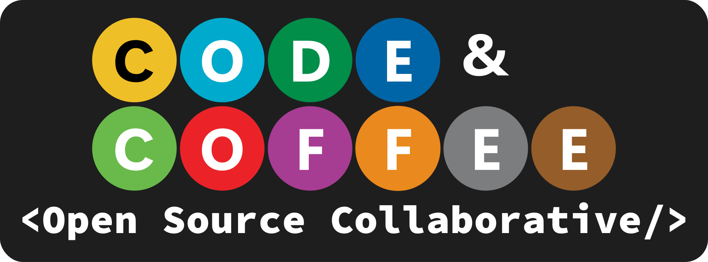

  
The Code and Coffee Open Source Collaborative is a group of loosely connected software developers, designers, and enthusiasts who are interested in working together to improve their skill sets and to build useful cool things. All things built and maintained under the umbrella of the Open Source Collaborative are, as the name suggests, Open Source and freely available to anyone who wants to use them. 

The aims of the Open Source Collective, in order of priority, are as follows:

1. To improve the skill sets of the collaborators by allowing them to build projects they are interested in.
2. Help Code and Coffee Organizers and Members with providing tools to the community to help build and maintain the community.
3. Build and maintain tools that communities outside of Code and Coffee can use to help them expand their own communities.

There are three roles that Collaborators may take in the Open Source Collaborative. These roles are not mutually exclusive, a Collaborator may take on multiple roles.

- **Project Manager** - Collaborators who are in charge of leading specific features or projects within the Open Source Collaborative. They will coordinate work with other Collaborators and take ownership of features and projects they opt in to manage.
- **Developer** - Collaborators with interested in coding who are in charge of actually building out the code for new features and projects. 
- **Designers** - Collaborators with an interest in design who are in charge of designing the user interface for features and projects that have a user interface.

Anyone may opt to join into the Collaborative as an active Collaborator at any time. When one opts in to the Collaborative they must take on one or more role, which helps communicate to the rest of the Collaborative the kinds of work they are interested in performing. When one opts into the Collaborative they are added to the list of active Collaborators and may formally take on tasks or projects as part of the Collaborative. To opt into the Collaborative one must fill out the following form:

***INSERT FORM LINK HERE***

The Collaborative is inteded to be a light commiment opportunity. Collaborators can commit themselves as much or as little as they like to projects the Collaborative is managing.

See [Collaborators](./collaborators.md) for the list of currently active Collaborators